Medical Cost Personal Datasets
================

<style type="text/css">


h1.title {
  font-size: 22px;
  color: DarkRed;
}
h1 { /* Header 1 */
  font-size: 20px;
  color: DarkBlue;
}
h2 { /* Header 2 */
    font-size: 18px;
  color: DarkBlue;
}
h3 { /* Header 3 */
  font-size: 14px;
  color: DarkBlue;
}
</style>

# Introduction

## Dataset

The dataset used for this analysis is the medical cost personal
dataset.The dataset provides key customer characteristics, such as age,
sex, bmi and smoking status, and finally provides medical costs billed
by health insurance for each individual. The ultimate aim is to
accurately predict insurance costs using the variables in the dataset.

The data was obtained from Kaggle
(<https://www.kaggle.com/mirichoi0218/insurance>).

## Objectives

The purpose of this analysis is to initially develop an understanding of
the variables that influence the outcome variable ‘charges’ in the
health insurance dataset. This will subsequently allow us to use our
model to make predictions of customer charges based on key
characteristics of the individual.

To do this we will use a linear regression model, moving from simple
linear regression to multiple linear regression.

So two key questions to answer are:

1.  Is there a significant relationship between any of the variables and
    customer charges?
2.  Can the model be used to infer customer charges based on key
    variable values?

# Preliminary Analysis

Firstly, we will load any relevant libraries into R.

``` r
# Load libraries

library(tidyverse)

#install.packages("psych")

library(psych)

#install.packages("gmodels")

library(gmodels)

#install.packages("gridExtra")

library(gridExtra)

#install.packages("hrbrthemes", repos = "https://cinc.rud.is") # theme for ggplot2

#see https://github.com/hrbrmstr/hrbrthemes
library(hrbrthemes) # provides nice, clean theme for ggplot 

theme_set(theme_ipsum_rc())

#install.packages("summarytools")

library(summarytools)

library(MLmetrics)

#devtools::install_github("yeukyul/lindia")
library(lindia)

#install.packages("mctest")

library(mctest)
```

Next, we will load the data, and have a ‘peak’.

``` r
insurance_data <- read_csv("insurance.csv")
```

    ## Parsed with column specification:
    ## cols(
    ##   age = col_double(),
    ##   sex = col_character(),
    ##   bmi = col_double(),
    ##   children = col_double(),
    ##   smoker = col_character(),
    ##   region = col_character(),
    ##   charges = col_double()
    ## )

``` r
head(insurance_data)
```

    ## # A tibble: 6 x 7
    ##     age sex      bmi children smoker region    charges
    ##   <dbl> <chr>  <dbl>    <dbl> <chr>  <chr>       <dbl>
    ## 1    19 female  27.9        0 yes    southwest  16885.
    ## 2    18 male    33.8        1 no     southeast   1726.
    ## 3    28 male    33          3 no     southeast   4449.
    ## 4    33 male    22.7        0 no     northwest  21984.
    ## 5    32 male    28.9        0 no     northwest   3867.
    ## 6    31 female  25.7        0 no     southeast   3757.

We can see the key variables, age, sex, bmi, number of children, smoking
status and region. The final variable is the insurance cost for that
individual.

## Data Exploration

Initial data exploration is critical for a number of reasons, some of
which being:

  - Identify missing values and outliers.
  - Examine datatypes and distributions.

<!-- end list -->

``` r
str(insurance_data)
```

    ## tibble [1,338 × 7] (S3: spec_tbl_df/tbl_df/tbl/data.frame)
    ##  $ age     : num [1:1338] 19 18 28 33 32 31 46 37 37 60 ...
    ##  $ sex     : chr [1:1338] "female" "male" "male" "male" ...
    ##  $ bmi     : num [1:1338] 27.9 33.8 33 22.7 28.9 ...
    ##  $ children: num [1:1338] 0 1 3 0 0 0 1 3 2 0 ...
    ##  $ smoker  : chr [1:1338] "yes" "no" "no" "no" ...
    ##  $ region  : chr [1:1338] "southwest" "southeast" "southeast" "northwest" ...
    ##  $ charges : num [1:1338] 16885 1726 4449 21984 3867 ...
    ##  - attr(*, "spec")=
    ##   .. cols(
    ##   ..   age = col_double(),
    ##   ..   sex = col_character(),
    ##   ..   bmi = col_double(),
    ##   ..   children = col_double(),
    ##   ..   smoker = col_character(),
    ##   ..   region = col_character(),
    ##   ..   charges = col_double()
    ##   .. )

Looking at the above, we can see the data type associated with each
variable, it may be necessary to alter some of these going forward. For
example, to clearly mark variables such as smoker and region as
categorical in R, we can change them to
    factors.

``` r
summary(insurance_data)
```

    ##       age            sex                 bmi           children    
    ##  Min.   :18.00   Length:1338        Min.   :15.96   Min.   :0.000  
    ##  1st Qu.:27.00   Class :character   1st Qu.:26.30   1st Qu.:0.000  
    ##  Median :39.00   Mode  :character   Median :30.40   Median :1.000  
    ##  Mean   :39.21                      Mean   :30.66   Mean   :1.095  
    ##  3rd Qu.:51.00                      3rd Qu.:34.69   3rd Qu.:2.000  
    ##  Max.   :64.00                      Max.   :53.13   Max.   :5.000  
    ##     smoker             region             charges     
    ##  Length:1338        Length:1338        Min.   : 1122  
    ##  Class :character   Class :character   1st Qu.: 4740  
    ##  Mode  :character   Mode  :character   Median : 9382  
    ##                                        Mean   :13270  
    ##                                        3rd Qu.:16640  
    ##                                        Max.   :63770

The above summary table gives us an overview of each variable. For the
numeric variables, we can see key descriptive statistics.

For the categorical variables, we can use the following function to get
a more detailed overview of the content.

``` r
gmodels::CrossTable(insurance_data$sex)
```

    ## 
    ##  
    ##    Cell Contents
    ## |-------------------------|
    ## |                       N |
    ## |         N / Table Total |
    ## |-------------------------|
    ## 
    ##  
    ## Total Observations in Table:  1338 
    ## 
    ##  
    ##           |    female |      male | 
    ##           |-----------|-----------|
    ##           |       662 |       676 | 
    ##           |     0.495 |     0.505 | 
    ##           |-----------|-----------|
    ## 
    ## 
    ## 
    ## 

``` r
gmodels::CrossTable(insurance_data$smoker)
```

    ## 
    ##  
    ##    Cell Contents
    ## |-------------------------|
    ## |                       N |
    ## |         N / Table Total |
    ## |-------------------------|
    ## 
    ##  
    ## Total Observations in Table:  1338 
    ## 
    ##  
    ##           |        no |       yes | 
    ##           |-----------|-----------|
    ##           |      1064 |       274 | 
    ##           |     0.795 |     0.205 | 
    ##           |-----------|-----------|
    ## 
    ## 
    ## 
    ## 

``` r
gmodels::CrossTable(insurance_data$region)
```

    ## 
    ##  
    ##    Cell Contents
    ## |-------------------------|
    ## |                       N |
    ## |         N / Table Total |
    ## |-------------------------|
    ## 
    ##  
    ## Total Observations in Table:  1338 
    ## 
    ##  
    ##           | northeast | northwest | southeast | southwest | 
    ##           |-----------|-----------|-----------|-----------|
    ##           |       324 |       325 |       364 |       325 | 
    ##           |     0.242 |     0.243 |     0.272 |     0.243 | 
    ##           |-----------|-----------|-----------|-----------|
    ## 
    ## 
    ## 
    ## 

So we can see an equal split for gender and region, while the majority
are non-smokers.

The above variables are clearly categorical. However, when we look at
the ‘children’ variable, we can probably also describe this as
categorical here, given there are distinct groups in the data, as shown
below.

``` r
gmodels::CrossTable(as.factor(insurance_data$children))
```

    ## 
    ##  
    ##    Cell Contents
    ## |-------------------------|
    ## |                       N |
    ## |         N / Table Total |
    ## |-------------------------|
    ## 
    ##  
    ## Total Observations in Table:  1338 
    ## 
    ##  
    ##           |         0 |         1 |         2 |         3 |         4 | 
    ##           |-----------|-----------|-----------|-----------|-----------|
    ##           |       574 |       324 |       240 |       157 |        25 | 
    ##           |     0.429 |     0.242 |     0.179 |     0.117 |     0.019 | 
    ##           |-----------|-----------|-----------|-----------|-----------|
    ## 
    ## 
    ##           |         5 | 
    ##           |-----------|
    ##           |        18 | 
    ##           |     0.013 | 
    ##           |-----------|
    ## 
    ## 
    ## 
    ## 

The distribution above confirm small sample sizes in groups 4 children
and 5 children. Such small sample sizes may prove problematic when we
build a regression model (for example, may result in very broad
confidence intervals). It may therefore be prudent to group this
variable into 0 - 2 children and 3 - 5 children.

``` r
insurance_data <- insurance_data %>%
  mutate(
    children_group = case_when(
      children <= 2 ~ 0,
      children >= 3 ~ 1,
      TRUE ~ children
    )
  )

insurance_data$children_group <- as.factor(insurance_data$children_group)

head(insurance_data) # peak at the data
```

    ## # A tibble: 6 x 8
    ##     age sex      bmi children smoker region    charges children_group
    ##   <dbl> <chr>  <dbl>    <dbl> <chr>  <chr>       <dbl> <fct>         
    ## 1    19 female  27.9        0 yes    southwest  16885. 0             
    ## 2    18 male    33.8        1 no     southeast   1726. 0             
    ## 3    28 male    33          3 no     southeast   4449. 1             
    ## 4    33 male    22.7        0 no     northwest  21984. 0             
    ## 5    32 male    28.9        0 no     northwest   3867. 0             
    ## 6    31 female  25.7        0 no     southeast   3757. 0

Above, we have coded individuals with 0 - 2 children as 0 and those with
3 - 5 as 1, then converted this variable into a factor. Categorising
this way will make for easier interpretation of the regression model. We
have done this while retaining the original variable of ‘children’,
which will allow for comparison later.

At this point, we can also convert the other categorical variables into
factors, so r knows to deal with them as such.

Categorical variables enter into statistical models differently than
continuous variables, storing data as factors insures that the modeling
functions will treat such data correctly.

``` r
# As easy method to convert variables into factors

insurance_data$sex <- as.factor(insurance_data$sex)

insurance_data$smoker <- as.factor(insurance_data$smoker)

insurance_data$region <- as.factor(insurance_data$region)

insurance_data$children <- as.factor(insurance_data$children)
```

To make sure this has all worked as expected, we can check the structure
of the dataset, as below.

``` r
str(insurance_data)
```

    ## tibble [1,338 × 8] (S3: spec_tbl_df/tbl_df/tbl/data.frame)
    ##  $ age           : num [1:1338] 19 18 28 33 32 31 46 37 37 60 ...
    ##  $ sex           : Factor w/ 2 levels "female","male": 1 2 2 2 2 1 1 1 2 1 ...
    ##  $ bmi           : num [1:1338] 27.9 33.8 33 22.7 28.9 ...
    ##  $ children      : Factor w/ 6 levels "0","1","2","3",..: 1 2 4 1 1 1 2 4 3 1 ...
    ##  $ smoker        : Factor w/ 2 levels "no","yes": 2 1 1 1 1 1 1 1 1 1 ...
    ##  $ region        : Factor w/ 4 levels "northeast","northwest",..: 4 3 3 2 2 3 3 2 1 2 ...
    ##  $ charges       : num [1:1338] 16885 1726 4449 21984 3867 ...
    ##  $ children_group: Factor w/ 2 levels "0","1": 1 1 2 1 1 1 1 2 1 1 ...

At this point, we should also examine the distribution of the variables
against charges. This will provide us with some early insight into key
relationships in the
data.

``` r
plot_gender <- ggplot(data = insurance_data, mapping = aes(x = sex, y = charges)) +
  geom_boxplot(colour = "#1F3552", fill = "#4271AE", alpha = 0.7, outlier.color = "red",
               outlier.alpha = 0.2) +
  #ggtitle("Charges against Gender") +
  theme_ipsum_rc() +
  labs(x = "Gender", y = "Charges") +
  scale_y_comma()

#plot_gender

plot_children <- ggplot(data = insurance_data, mapping = aes(x = children, y = charges)) +
  geom_boxplot(colour = "#1F3552", fill = "#4271AE", alpha = 0.7, outlier.color = "red",
               outlier.alpha = 0.2) +
  #ggtitle("Charges against Number of Children") +
  theme_ipsum_rc() +
  labs(x = "Number of Children", y = "Charges") +
  scale_y_comma()

#plot_children

plot_smoker <- ggplot(data = insurance_data, mapping = aes(x = smoker, y = charges)) +
  geom_boxplot(colour = "#1F3552", fill = "#4271AE", alpha = 0.7, outlier.color = "red",
               outlier.alpha = 0.2) +
  #ggtitle("Charges against Smoking Status") +
  theme_ipsum_rc() +
  labs(x = "Smoking Status", y = "Charges") +
  scale_y_comma()
  # strong relationship here

#plot_smoker

plot_region <- ggplot(data = insurance_data, mapping = aes(x = region, y = charges)) +
  geom_boxplot(colour = "#1F3552", fill = "#4271AE", alpha = 0.7, outlier.color = "red",
               outlier.alpha = 0.2) +
  #ggtitle("Charges against Region") +
  theme_ipsum_rc() +
  labs(x = "Region", y = "Charges") +
  scale_y_comma() +
  theme(axis.text.x = element_text(angle = 45, hjust = 1))

grid.arrange(plot_children, plot_gender, plot_region, plot_smoker, top = grid::textGrob("Categorical Variables - Against Charges", x = 0, hjust = 0))
```

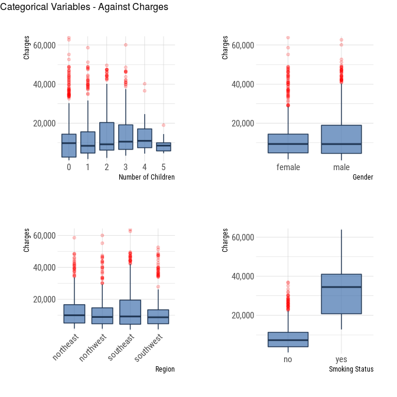

The most apparent trend in the boxplots above, is the difference in
charges between smokers and non-smokers. As would be expected, smokers
incur higher medical insurance charges then non-smokers. This is an
important finding for the determination of which variables to include in
our final model.

Next, we can look at the distribution of continuous variables against
charges. This is best done using scatter plots. The two continuous
variables are age and
BMI.

``` r
plot_age <- ggplot(data = insurance_data, mapping = aes(x = age, y = charges)) +
  geom_point(colour = "#4271AE") +
  theme_ipsum_rc() +
  labs(x = "Age", y = "Charges") +
  scale_y_comma()

#plot_age

plot_bmi <- ggplot(data = insurance_data, mapping = aes(x = bmi, y = charges)) +
  geom_point(colour = "#4271AE") +
  theme_ipsum_rc() +
  labs(x = "BMI", y = "Charges") +
  scale_y_comma()

#plot_bmi


grid.arrange(plot_age, plot_bmi, ncol = 2, top = grid::textGrob("Continuous Variables - Against Charges", x = 0, hjust = 0))
```

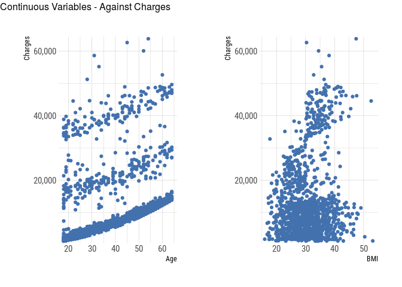

Although there is nothing as striking as the relationship between
smoking and charges, we can firstly see in the BMI plot, perhaps the
presence of two group.

It is difficult to discern a relationship from the age plot. However,
there appears to be a slightly non-linear relationship between age and
charges, shown by the slight curve in the distributions.

The linear regression model assumes that there is a straight-line
relationship between the predictors (x axis) and the response (y axis).
Although only a slight curve, it is worth trying to resolve this.

A basic approach is to use non-linear transformations of the predictors,
such as log X, √X, and X^2. Below, we will see the same plot, but age
squared.

``` r
ggplot(data = insurance_data, mapping = aes(x = age^2, y = charges)) +
  geom_point(colour = "#4271AE") +
  theme_ipsum_rc() +
  labs(x = "Age", y = "Charges") +
  scale_y_comma()
```

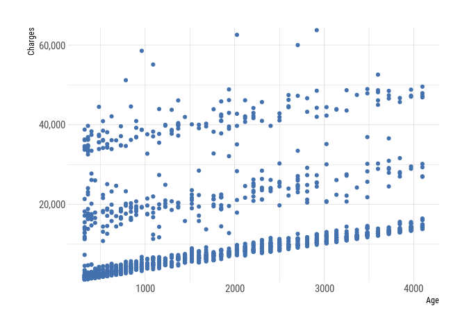

We can see the code now produces a chart with a straight line
relationship between age and charges.

This will be useful later when we compare and contrast models.
Therefore, we will add age^2 as a variable to our dataset…

``` r
insurance_data <- insurance_data %>%
  mutate(
    age_sqr = age^2 
  )
```

Another way to look at the data, is the look at the relationship between
the predictor variables themselves i.e. is the relationship between
predictor 1 (x1) and outcome (y) dependent on the presence/influence of
another predictor (x2). In short, perhaps the predictor variables are
not independent of each other, in terms of their relationships with the
outcome variable (y - in this case, charges).

For example, is the relationship between BMI and charges dependent on
gender?

``` r
plot_bmi_gender <- ggplot(data = insurance_data, mapping = aes(x = bmi, y = charges)) +
  geom_point(aes(colour = sex)) +
  labs(x = "BMI", y = "Charges") +
  scale_y_comma() +
  scale_color_ft()

plot_bmi_gender
```

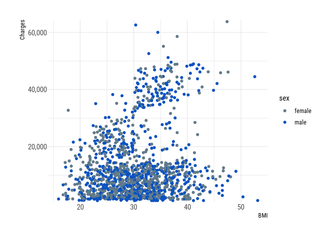

The chart above doesn’t indicate any interaction between gender and BMI,
in terms of the relationship with charges.

A much clearer example is
below.

``` r
plot_bmi_smoking <- ggplot(data = insurance_data, mapping = aes(x = bmi, y = charges)) +
  geom_point(aes(colour = smoker)) +
  theme_ipsum_rc() +
  labs(x = "BMI", y = "Charges") +
  scale_y_comma() +
  scale_color_ft()

plot_bmi_smoking
```


This plot strongly indicates an interaction between BMI and smoking
status. This can be explained as follows: *The relationship between BMI
and charges is strongly dependent on the individuals smoking status. For
a smoker, as BMI increases the health insurance charge also increases.
However, for a non-smoker, as BMI increases, no such relationship seems
to exist - charges do not increase.*

This will be important when we build our model. Indeed, we can account
for this interaction in our model, which will be described later.

Given the small number of variables in this data, it was possible to
work through them individually. However, we can use a matrix to
visualise relationships between multiple variables. A number are
available. One example being the ‘pairs.panels’ from the library psych.
Such a plot allows us to visualise numerous correlations and plots in
one go.

``` r
psych::pairs.panels(insurance_data,
                    method = "spearman",
                    hist.col = "purple",
                    density = TRUE,
                    ellipses = FALSE)
```

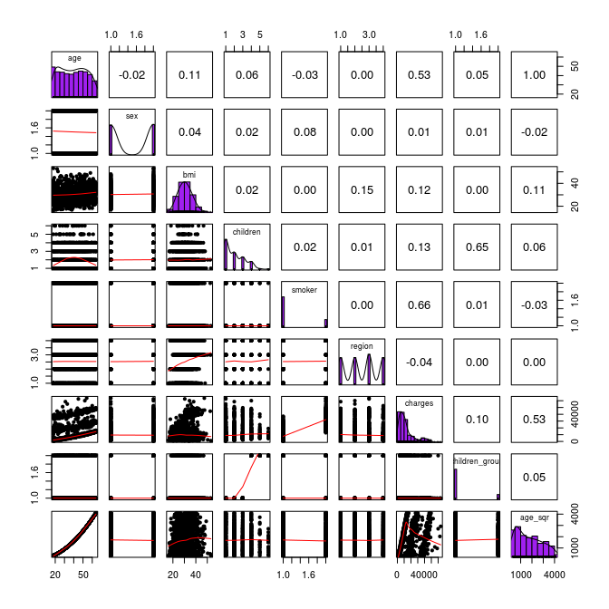

## Story so Far

Our analysis so far has allowed to us determine the general distribution
of the predictor variables. This in turn has allowed us to identify
variables with unbalanced distributions, such as number of children, and
a variable with a slightly non-linear relationship with charges, age. We
therefore created some new variables to address these issues. No doubt
we could create additional variables, further grouping and refining our
existing variables, but we will stick to what we have for now, and add
additional ones going forward if needed.

We also explored some key interactions between some of the predictor
variables. This identified a key relationship between smoking status and
BMI, where the increase in charges with increasing BMI was dependent on
smoking status.

Together, these factors will help shape our linear regression model.

# Simple Linear Regression

Linear regression is a simple approach for supervised learning. In
particular, it is useful for predicting a quantitative response.

Correlation is a measure of the strength of the relationship between two
variables. But more often we want to be able to *describe and quantify
the relationship between two variables,* and linear regression allows us
to do this.

*The ultimate aim is to use one variable to predict another*

The outcome variable is always put on the y-axis and the predictor on
the x-axis.

These terms can be used, but often hear them referred to as independent
and dependent variables.

In this case, the outcome variable is quite obvious - individual medical
costs, *charges*.

So we are going to quantify a relationship between predictor variable(s)
and outcome variable by fitting a straight line to the data. *But we
want to make sure we fit an optimal straight line* The are many methods
to find a line of best fit, but the standard approach to use is called
least squares regression.

This approach fits a regression line that minimises the sum of the
squared vertical distances between the observed value and the fitted
line. The distances are called residuals. Residuals are calculated by
subtracting the predicted value from the observed value.

The formula for a straight line is:

\[y = \alpha + \beta X \]

When x is zero, you will see from the equation that y will just equal
alpha - as the beta term will disappear.

This means that alpha is the value of y where the regression line cuts
the y-axis.

And beta is the slope of the line.

\[\alpha = (y) intercept\]

\[\beta = slope of the line\] We will demonstrate this using an example,
with an explanation of the results.

Before fitting the model, we will split the data into training and test
data sets. This will allow us to develop our models using the training
data, and test the model using the test data.

``` r
set.seed(100)  # setting seed to reproduce results of random sampling

trainingRowIndex <- sample(1:nrow(insurance_data), 0.8*nrow(insurance_data))  # row indices for training data

trainingData <- insurance_data[trainingRowIndex, ] #model training data


testData  <- insurance_data[-trainingRowIndex, ]   # test data
```

Now lets build a simple linear regression model using 1 variable. Given
we suspect smoking status has a strong relationship with charges based
on our exploratory analysis, we will use smoking as the predictor
variable.

``` r
lm_simple <- lm(charges ~ smoker, data = trainingData)

# use summary to look at the results

summary(lm_simple)
```

    ## 
    ## Call:
    ## lm(formula = charges ~ smoker, data = trainingData)
    ## 
    ## Residuals:
    ##      Min       1Q   Median       3Q      Max 
    ## -18849.6  -5234.4   -826.6   3776.3  30913.9 
    ## 
    ## Coefficients:
    ##             Estimate Std. Error t value Pr(>|t|)    
    ## (Intercept)   8555.1      255.9   33.44   <2e-16 ***
    ## smokeryes    23123.9      569.5   40.61   <2e-16 ***
    ## ---
    ## Signif. codes:  0 '***' 0.001 '**' 0.01 '*' 0.05 '.' 0.1 ' ' 1
    ## 
    ## Residual standard error: 7477 on 1068 degrees of freedom
    ## Multiple R-squared:  0.6069, Adjusted R-squared:  0.6065 
    ## F-statistic:  1649 on 1 and 1068 DF,  p-value: < 2.2e-16

``` r
# look at confidence intervals 

confint(lm_simple)
```

    ##                 2.5 %    97.5 %
    ## (Intercept)  8053.063  9057.135
    ## smokeryes   22006.544 24241.297

The first item of interest above is labelled intercept. **This is the
value of alpha.** Another value we are interested in is labelled
smokeryes - **this is our beta estimate**. And it is 23123.9. If we look
along this row, we will see the p value for beta, which is 2e-16 (2.2 X
10 ^ -16), which is extremely small.

To put this into context, for a one unit increase in our predictor,
smoking status, it is estimated that charges increase by $23,123.90.
This is how you interpret the beta coefficient in the model of interest.

Another important thing to note, is that the variable smoking is
categorical (a factor in r). What the model is doing is comparing the
mean charge for ‘yes’ against the reference category, which in this case
is ‘no’ i.e. moving from no to yes in terms of smoking status increases
the charges on average by $23,123.90.

Furthermore, the very small p value allows us to reject the null
hypothesis of no relationship between the predictor and the outcome
variable.

*The null hypothesis is whether the population parameter is 0. For beta,
if there is a 0 slope, then there is no relationship between the
predictor and the outcome. Here the p value is very small, so the
evidence against a null hypothesis is strong.*

Given this, we can see that the equation could potentially be used to
predict the outcome variable.

charges = 8555.1 + 23,123.9 x smoker

*It would have been better to recode ‘smoker’ as 0 (no) and 1 (yes) -
this makes it easier to interpret the equation.* For example, if not a
smoker, the predicted charge is simply $8,555.10 (as 23,123.9 x 0 = 0).

The assess the goodness of fit to this model, we look at the R-squared
and the adjusted R-squared values. How much variation does this model
explain? **You can see that the adjusted R-squared value is 0.61 meaning
the model is explaining around 61% of the total variability in the
observed data.**

A brief explanation of the R-squared value is as follows:

The regression line will explain a proportion of the variability in the
data, and the residuals indicate how much variability is left
unexplained after we fitted the regression line. Therefore R squared is
measure of how much variability is explained by the model as a
proportion of the total variability of the data. As a consequence R^2 is
a value between 0 and 1.

The adjusted R-squared penalises for the number of predictor variables
included in the model. Therefore, it’s a better measure to compare our
models with - which is more relevant later for our multiple linear
regression models.

Overall, the model confirms a significant relationship between smoking
status and charges…

``` r
ggplot(data = insurance_data, mapping = aes(x = smoker, y = charges)) +
  geom_point(colour = "#4271AE") +
  theme_ipsum_rc() +
  labs(x = "Smoker", y = "Charges") +
  scale_y_comma()
```

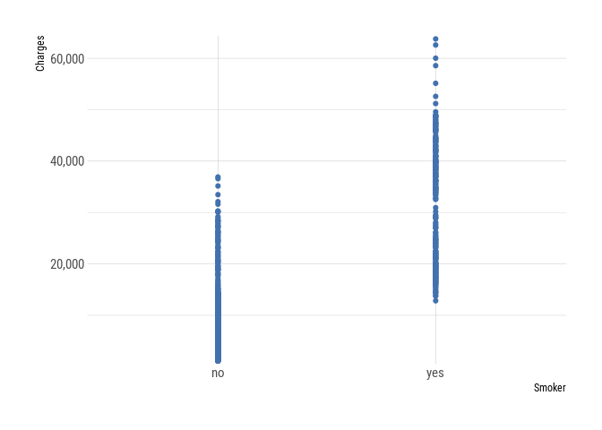

# Multiple linear regression

Next we will extend our simple linear regression model into a multiple
regression model. The first thing we need to decide is what variables to
include as out predictor. Given the number of variables in this dataset
is small, we could investigate some of the relationships individually,
as we did earlier, and this allows us make informed decisions about
which variables to include.

We need to be careful not include too many variables, as we may risk
overfitting the model. This occurs when there are too many variables
included and the model fits the data too closely. We end up just
explaining random error, rather than real relationships.

However, we also need enough variables to allow the model parameters to
be appropriately estimated.

There are some automated methods available to select variables, which
are sometimes used when there are a large number. Examples include
forward selection, backward selection and a setpwise approach. These add
variables step by step, only keeping those that achieve a certain
criteria. However, it is often better to select variables based on
published literature, which have confirmed known relationships, as well
as your own findings as an investigator.

For example, from our analysis earlier, we could see that smoking is
strongly relation with charges, and this also had a bearing on the
relationship between BMI and charges. In addition, it is not
unreasonable to think that insurance charges will increase with age.
This then gives a starting point up to build a model with.

``` r
lm_multiple_v1 <- lm(charges ~ bmi + smoker + age, data = trainingData)


summary(lm_multiple_v1)
```

    ## 
    ## Call:
    ## lm(formula = charges ~ bmi + smoker + age, data = trainingData)
    ## 
    ## Residuals:
    ##    Min     1Q Median     3Q    Max 
    ## -12203  -3100  -1104   1268  29423 
    ## 
    ## Coefficients:
    ##              Estimate Std. Error t value Pr(>|t|)    
    ## (Intercept) -10807.72    1046.57 -10.327   <2e-16 ***
    ## bmi            304.62      30.63   9.945   <2e-16 ***
    ## smokeryes    23304.28     469.79  49.606   <2e-16 ***
    ## age            253.89      13.47  18.843   <2e-16 ***
    ## ---
    ## Signif. codes:  0 '***' 0.001 '**' 0.01 '*' 0.05 '.' 0.1 ' ' 1
    ## 
    ## Residual standard error: 6167 on 1066 degrees of freedom
    ## Multiple R-squared:  0.733,  Adjusted R-squared:  0.7323 
    ## F-statistic: 975.7 on 3 and 1066 DF,  p-value: < 2.2e-16

Our first model included BMI, smoking status and age as predictor
variables, and the model was able to explain 73% of the variation in the
data, shown by the adjusted R-squared. In addition, all three of our
variables have reached significance, meaning they are significantly
related to the outcome variable, charges.

However, if we remember from our analysis we noted there was a strong
interaction between smoking status and
BMI:

``` r
plot_bmi_smoking
```

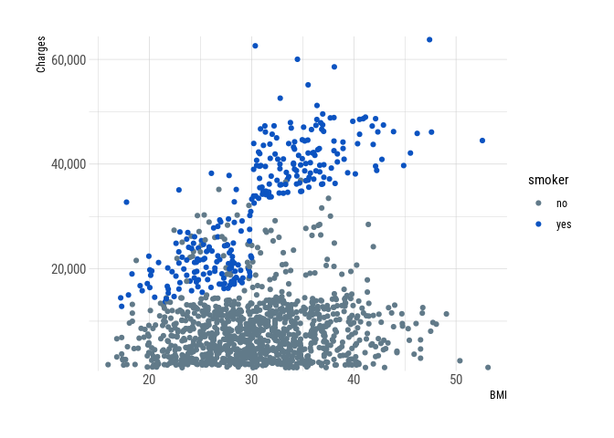

Our first multiple regression model assumed the two variables BMI and
smoker are independent and additive. However, this assumption may not
hold, and the presence of both conditions may interact to have a
different impact on the outcome. We can see this in the chart above,
where the relationship between BMI and charged is dependent on smoking
status. For a smoker, as BMI increases, so do charges. We can account
for this interaction using an interaction term in our model. We do this
by simply including an additional term, **multiplying the variable BMI
by smoker.**

In addition to our analysis with BMI and smoker, we also applied a
transformation to the age variable, to produce a linear relationship
between age and charges. We will also include this in the
model.

``` r
lm_multiple_v2 <- lm(charges ~ age_sqr + bmi*smoker, data = trainingData)

summary(lm_multiple_v2)
```

    ## 
    ## Call:
    ## lm(formula = charges ~ age_sqr + bmi * smoker, data = trainingData)
    ## 
    ## Residuals:
    ##      Min       1Q   Median       3Q      Max 
    ## -14267.9  -2086.8  -1486.8   -325.1  30032.6 
    ## 
    ## Coefficients:
    ##                 Estimate Std. Error t value Pr(>|t|)    
    ## (Intercept)     2838.345    881.203   3.221  0.00132 ** 
    ## age_sqr            3.322      0.136  24.422  < 2e-16 ***
    ## bmi               -4.051     28.057  -0.144  0.88521    
    ## smokeryes     -19808.341   1869.445 -10.596  < 2e-16 ***
    ## bmi:smokeryes   1413.935     59.959  23.582  < 2e-16 ***
    ## ---
    ## Signif. codes:  0 '***' 0.001 '**' 0.01 '*' 0.05 '.' 0.1 ' ' 1
    ## 
    ## Residual standard error: 4997 on 1065 degrees of freedom
    ## Multiple R-squared:  0.8249, Adjusted R-squared:  0.8243 
    ## F-statistic:  1255 on 4 and 1065 DF,  p-value: < 2.2e-16

The new model has a greater Adjusted R squared value, and the
interaction term of bmi and smoker is highly significant, confirming
that the true relationship is not additive (not independent).

Another transformation we added to the data was the grouping of number
of children. This was due to the small sample sizes in the 4 and 5
children group. We can add this in to determine if it improves the
model. We coded this variable as 0 for 0-2 children and 1 for 3-5
children.

``` r
head(trainingData)
```

    ## # A tibble: 6 x 9
    ##     age sex      bmi children smoker region    charges children_group age_sqr
    ##   <dbl> <fct>  <dbl> <fct>    <fct>  <fct>       <dbl> <fct>            <dbl>
    ## 1    51 male    23.2 1        yes    southeast  22218. 0                 2601
    ## 2    20 male    30.1 5        no     northeast   4915. 1                  400
    ## 3    48 male    29.6 0        no     southwest  21232. 0                 2304
    ## 4    61 female  28.2 0        no     southwest  13042. 0                 3721
    ## 5    18 female  24.1 1        no     southeast   2201. 0                  324
    ## 6    18 female  31.1 0        no     southeast   1622. 0                  324

``` r
lm_multiple_v3 <- lm(charges ~ age_sqr + bmi*smoker + children_group , data = trainingData)

summary(lm_multiple_v3)
```

    ## 
    ## Call:
    ## lm(formula = charges ~ age_sqr + bmi * smoker + children_group, 
    ##     data = trainingData)
    ## 
    ## Residuals:
    ##      Min       1Q   Median       3Q      Max 
    ## -14156.5  -1945.2  -1373.9   -715.3  30212.2 
    ## 
    ## Coefficients:
    ##                   Estimate Std. Error t value Pr(>|t|)    
    ## (Intercept)      2.719e+03  8.804e+02   3.088  0.00207 ** 
    ## age_sqr          3.312e+00  1.357e-01  24.397  < 2e-16 ***
    ## bmi             -4.695e+00  2.799e+01  -0.168  0.86682    
    ## smokeryes       -1.992e+04  1.865e+03 -10.678  < 2e-16 ***
    ## children_group1  1.056e+03  4.244e+02   2.489  0.01297 *  
    ## bmi:smokeryes    1.417e+03  5.983e+01  23.685  < 2e-16 ***
    ## ---
    ## Signif. codes:  0 '***' 0.001 '**' 0.01 '*' 0.05 '.' 0.1 ' ' 1
    ## 
    ## Residual standard error: 4985 on 1064 degrees of freedom
    ## Multiple R-squared:  0.8259, Adjusted R-squared:  0.8251 
    ## F-statistic:  1010 on 5 and 1064 DF,  p-value: < 2.2e-16

The new addition is just about significant, and means we can reject the
null hypothesis of no relationship. In addition, the Adjusted R Squared
has marginally increased.

We can use the anova function in r to compare models v2 and v3 to
determine if there is a significant difference between the two. The
anova() function performs a hypothesis test comparing the two models.
The null hypothesis is that the two models fit the data equally well,
and the alternative hypothesis is that the model with ‘children\_group’
is superior.

``` r
anova(lm_multiple_v2, lm_multiple_v3)
```

    ## Analysis of Variance Table
    ## 
    ## Model 1: charges ~ age_sqr + bmi * smoker
    ## Model 2: charges ~ age_sqr + bmi * smoker + children_group
    ##   Res.Df        RSS Df Sum of Sq      F  Pr(>F)  
    ## 1   1065 2.6590e+10                              
    ## 2   1064 2.6436e+10  1 153893338 6.1938 0.01297 *
    ## ---
    ## Signif. codes:  0 '***' 0.001 '**' 0.01 '*' 0.05 '.' 0.1 ' ' 1

This confirms that the third model is marginally better, and has reached
significance over the second model without ‘children\_group’.

We will therefore use this as our final model to make our predictions
with.

## Collinearity

When developing a multiple linear regression model, it is important to
assess for a phenomenon called collinearity. This relates to the
relationship between the predictor variables. So in practice, variables
are often correlated to some extent, but if the correlation between two
predictors is strong, this can cause a problem when modelling - this is
known as collinearity and it refers to a strong linear relationship
between two predictors. It causes a problem because the two variables
are both explaining the same variance in the observations, which means
the variance can’t be separated between these two competing predicates.

When you have multiple predictors that collerate, this is called
multicollinearity. To detect this in a model, we can look at the
variance inflation factor (VIF), which estimates how much the variance
of a regression coefficient is inflated due to multicollinearity in the
model.

In r, it is possible to obtain the VIF for each predictor can be
obtained as
follows:

``` r
mctest::imcdiag(model.matrix(lm_multiple_v3)[,-1], lm_multiple_v3$model[1], method = "VIF")
```

    ## 
    ## Call:
    ## mctest::imcdiag(x = model.matrix(lm_multiple_v3)[, -1], y = lm_multiple_v3$model[1], 
    ##     method = "VIF")
    ## 
    ## 
    ##  VIF Multicollinearity Diagnostics
    ## 
    ##                     VIF detection
    ## age_sqr          1.0169         0
    ## bmi              1.2958         0
    ## smokeryes       24.1451         1
    ## children_group1  1.0018         0
    ## bmi:smokeryes   24.3660         1
    ## 
    ## Multicollinearity may be due to smokeryes bmi:smokeryes regressors
    ## 
    ## 1 --> COLLINEARITY is detected by the test 
    ## 0 --> COLLINEARITY is not detected by the test
    ## 
    ## ===================================

The test above gives a VIF score for each predictor. A score of 1 is
considered to indicate no correlation. There are no set rules for what
indicates high correlation, but typically, anything above 5 or 10 may be
considered high. We have a very high VIF for the bmi:smoker interaction
term and smoker variable, although this is to be expected given we added
this interaction term to the model.

## Predictions

Now lets predict some costs based on our test data.

``` r
ChargesPredict <- predict(lm_multiple_v3, testData)  # predict charges
```

To test the accuracy of our model, a simple correlation between the
actual and predicted values can be used to provide an
indication.

``` r
actuals_vs_preds <- data.frame(cbind(actuals=testData$charges, predicteds=ChargesPredict))

correlation_accuracy <- cor(actuals_vs_preds) 

correlation_accuracy
```

    ##              actuals predicteds
    ## actuals    1.0000000  0.9396212
    ## predicteds 0.9396212  1.0000000

There is a strong correlation between the two: 94%, which is good. We
can also use the Root Mean Squared Error (RMSE) to assess the accuracy
of the model. This represents the average difference between the
observed known outcome values in the test data and the predicted outcome
values by the model. The lower the RMSE, the better the model.

``` r
RMSE(ChargesPredict, testData$charges)
```

    ## [1] 4440.121

This value should be interpreted in context of the outcome variable,
charges. We can see the range of values below:

``` r
ggplot(data = insurance_data, mapping = aes(x = charges)) + 
  geom_histogram(fill = "#4271AE") +
  scale_x_comma() 
```

    ## `stat_bin()` using `bins = 30`. Pick better value with `binwidth`.

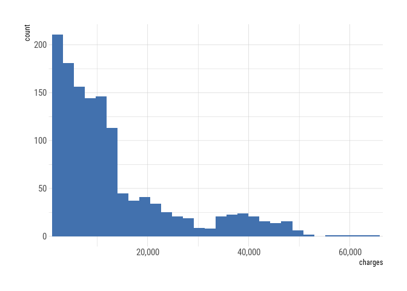

Given the broad range of costs, the RMSE of 4440.12 doesn’t seem too
unreasonable.

### Example Case

We can now try to enter some case data into the model, as follows:

``` r
newdata <- data.frame(
  age_sqr = 70^2,
  children_group = as.factor(1),
  smoker = factor("yes"),
  bmi = 20
)

predict(lm_multiple_v3, newdata = newdata)
```

    ##        1 
    ## 28326.76

# Model Diagnosis

There are a number of assumptions that should be assessed for a linear
regression model. This type of model is a referred to as a parametric
test, which make a number of assumptions about the underlying data. The
assumptions can be defined as follows:

  - Linearity between outcome (y) and predictor (x) - relationship is
    approx. linear between predictor and outcome variables.
  - For each value of the predictor variable, the outcome variable
    follows a normal distribution.
  - Assume that the variance is constant for each value of the
    predictor.

To determine whether these assumptions hold, we examine the residuals in
the model (residuals are distances between the observed values and the
fitted regression line).

**If the assumptions we described hold, then the distribution of the
residuals will be normal with a mean of zero and a constant variance
across the predictor values.**

We can check the assumptions of normally distributed residuals using a
Quantile-Quantile (Q-Q) plot. The Q-Q plot is a plot of the quartiles of
the residuals against the quartiles of a theoretical normal distribution
- if the residuals are normal then the observations will lie on a
straight line.

Below we will create a Q-Q plot from data we know are normally
distributed, so we know what a Q-Q plot would look ideally look like.
Note, the plot below is taken from this tutorial:
<https://www.storybench.org/diagnosing-the-accuracy-of-your-linear-regression-in-r/>

``` r
NormalData <- data.frame(
  norm_x = stats::rnorm(n = 1000, mean = 0, sd = 1),
  norm_y = stats::rnorm(n = 1000, mean = 1, sd = 3)
)

ggNormQQPlot <- NormalData %>%
  # name the 'sample' the outcome variable (norm_y)
  ggplot(mapping = aes(sample = norm_y)) +
  # add the stat_qq_band
  qqplotr::stat_qq_band(
    bandType = "pointwise",
    mapping = aes(fill = "Normal"), alpha = 0.5,
    show.legend = FALSE
  ) +
  # add the lines
  qqplotr::stat_qq_line() +
  # add the points
  qqplotr::stat_qq_point() +
  # add labs
  ggplot2::labs(
    x = "Theoretical Quantiles",
    y = "Sample Residuals",
    title = "Normal Q-Q plot for Simulated Data"
  )

ggNormQQPlot
```

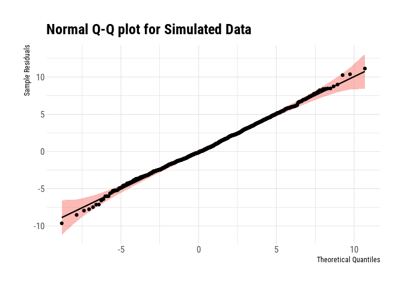

The focus on the plot above should be on the middle section, where we
can see the points sit on the line. You should always expect to see some
drift in the tails of a distribution of a Q-Q plot, as we can see above.

In order to assess the assumption of constant variance across the
predictor (homogeneity of variance), then a useful plot is to view the
residuals by the fitted regression values, or the predictive variable.
In this plot, the residuals are on the y-axis, and the fitted values
from the regression line are on the x-axis. What this should show you is
an equal scatter of residual values around the mean value of zero. What
you don’t want to see is variability in the scatter.

To assess these assumptions in our multiple regression model, the
quickest function to use is plot(). This generates a number of
diagnostic plots, with which we can diagnose our
model.

``` r
plot(lm_multiple_v3)
```

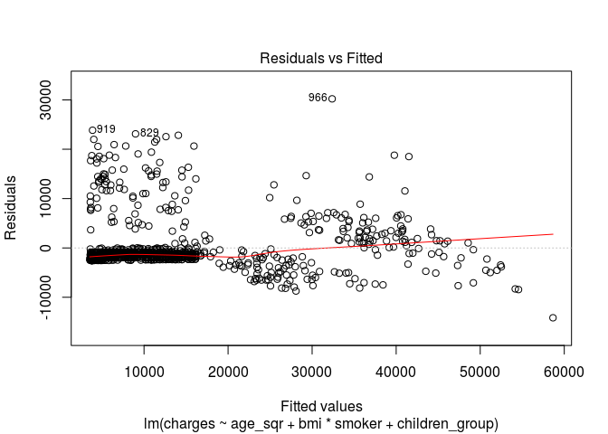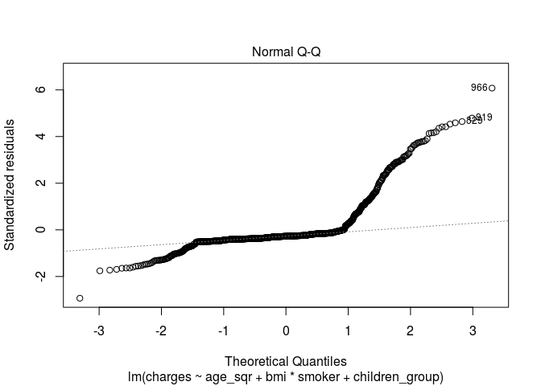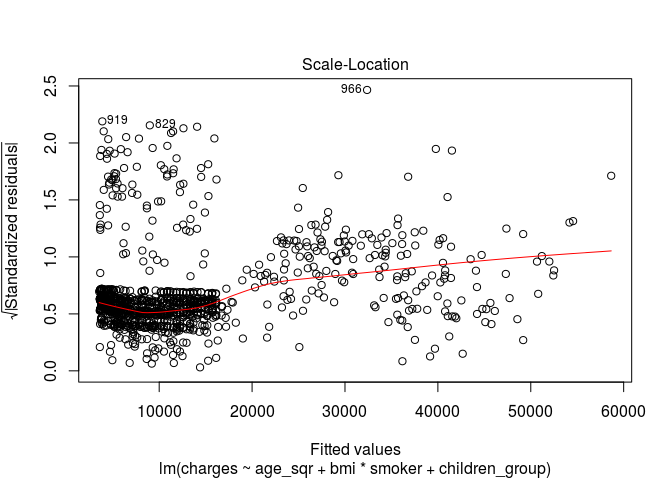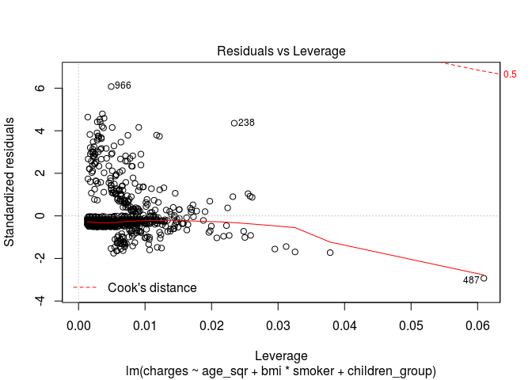

There is also a package called lindia, which includes a function calles
gg\_diagnose(), which produces a large number of diagnostic plots.
Otherwise, you can produce just the ones required:

``` r
final_QQ <- lindia::gg_qqplot(lm_multiple_v3)

final_resfit <- lindia::gg_resfitted(lm_multiple_v3)

#final_spread <- lindia::gg_scalelocation(lm_multiple_v3)

#grid.arrange(final_QQ, final_resfit, ncol = 2, top = grid::textGrob("Q-Q Plot and Residuals Against Fitted", x = 0, hjust = 0))

final_QQ
```

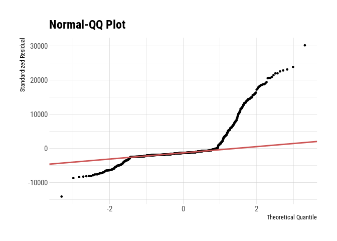

``` r
final_resfit
```

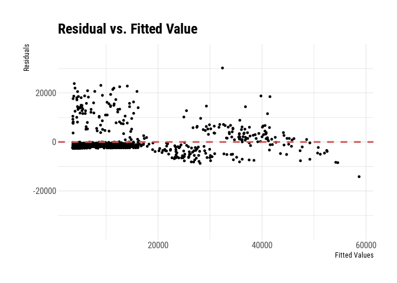

The diagnostic plots have therefore revealed some issues with our model.
Firstly, the Q-Q plot indicates the residuals are not normally
distributed. In addition, the residual vs fitted value plot is not
equally spread out. There are a large cluster of points to the left.
This reflects a lack of a linear relationship between our predictors and
the outcome variable in our model. In addition, data are homoscedastic
if the variance is the same across all values of predictor variables, we
can see from the scale-location plot (produced by plot()), that this
isn’t the case.

# Conclusion

In conclusion, we produced a model that was able to explain
approximately 83% of the variance in our data. In addition, our test
data confirmed a strong correlation between predicted and actual values,
indicating the model has some effectiveness as a predictive model.
However, upon diagnosis, we identified some issues with assumptions
around our underlying data.

Next steps could include investigating further potential transformation
in the data, to improve the distributions of the residuals. In addition,
the use of an alternative type of model may also be more appropriate for
this type of data.
